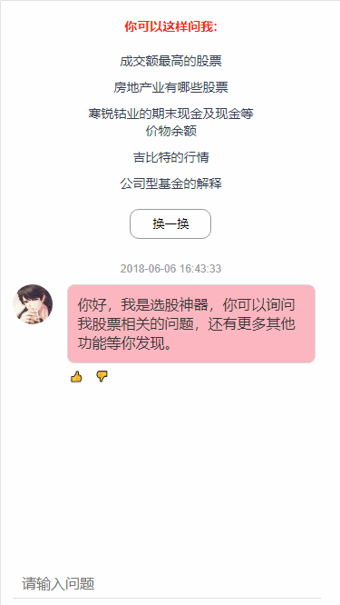

# 选股机器人（移动端/小程序）

**A Vue + Mpvue Project**（一体化移动端与小程序开发）

> [Vue](https://cn.vuejs.org/) 是一套用于构建用户界面的渐进式框架。`Vue` 的核心库只关注视图层，不仅易于上手，还便于与第三方库或既有项目整合。另一方面，当与现代化的工具链以及各种支持类库结合使用时，`Vue` 也完全能够为复杂的单页应用提供驱动。

> [mpvue](http://mpvue.com/) 是一个使用 `Vue.js` 开发小程序的前端框架。框架基于 `Vue.js` 核心，`mpvue` 修改了 `Vue.js` 的 runtime 和 compiler 实现，使其可以运行在小程序环境中，从而为小程序开发引入了整套 `Vue.js` 开发体验。

## 简介

> [一个同时支持移动端与小程序的聊天机器人](https://www.jianshu.com/p/91e566bfeedf)

## Build Setup

```bash
# install dependencies
npm install

# build mini program
npm run dev

# build H5 pages
npm run devH5

# build for production with minification for mini program
npm run build

# build for production with minification for H5 pages
npm run buildH5

# build for production and view the bundle analyzer report
npm run build --report
```

## 重要！！！

- 请在`project.config.json`文件,`appid`处填写自己注册的微信 appid;
- [echarts-for-weixin](https://github.com/ecomfe/echarts-for-weixin)**支持微信版本 >= 6.6.3，对应基础库版本 >= 1.9.91**。

## 特性

- 使用 `Vue.js` 构建移动端应用
- 使用 `mpvue` 复用代码构建小程序应用
- 使用 [Vuex](https://github.com/vuejs/vuex) 数据管理方案，方便构建复杂应用
- 使用 [webpack](https://github.com/webpack/webpack) 构建机制：自定义构建策略、开发阶段 hotReload
- 支持使用 [npm](https://github.com/npm/npm) 外部依赖

## 插件

- [Echarts](https://github.com/apache/incubator-echarts)
  一个使用 JavaScript 实现的开源可视化库，可以流畅的运行在 PC 和移动设备上，兼容当前绝大部分浏览器（IE8/9/10/11，Chrome，Firefox，Safari 等），底层依赖轻量级的矢量图形库 ZRender，提供直观，交互丰富，可高度个性化定制的数据可视化图表。
- [Day.js](https://github.com/iamkun/dayjs)
  一个轻量的处理时间和日期的 JavaScript 库，和 Moment.js 的 API 设计保持完全一样. 如果您曾经用过 Moment.js, 那么您已经知道如何使用 Day.js

## 截图

**移动端 & 小程序**

 

## Contribution

[RuShi](https://github.com/zz570557024)

## License

[MIT](http://opensource.org/licenses/MIT)

## 其它脚本

# eslint 检查

npm run lint

# eslint 自动修复

npm run fix

# 生产环境 build

npm run build
